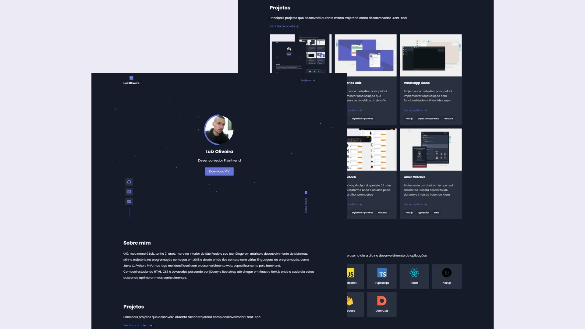

### Portfólio

Portfólio pessoal com projetos que desenvolvi durante minha trajetória como desenvolvedor

O site possui uma página inicial e uma página de projetos   
Para a página inicial foi utilizado a função <b><i>getStaticProps</i></b> do Next.js para obter os projetos fixados e tecnologias fornecidos pelo DatoCMS   
Para a página de projetos foram utilizadas as funções <b><i>getStaticProps</i></b> e <b><i>getStaticPaths</i></b> do Next.js para obter todos os projetos fornecidos pelo DatoCMS e assim criar a paginação e os filtros de projetos por tecnologia

### Tecnologias
- Next.js
- TypeScript
- SASS
- DatoCMS
- AOS